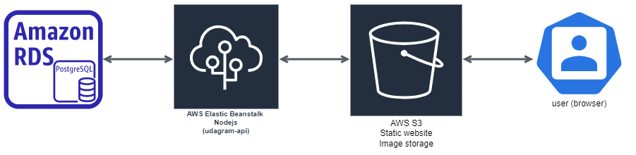

## Infrastructure

This document explains the underlying infrastructure used to deploy this project 

This project is mostly deployed using AWS services. Below is a list of services used

### services
1. `RDS`: To satisfy our database requirements, this project needs a postgres database. AWS RDS has a great service for this. A postgres databse is created and hosted using AWS RDS and the required credentails are fed into the environment using environment variables.

2. `Elastic Beanstalk`: This is the main service used to deploy the backend code for this project. This service is used to deploy the project on a server. The server is created using AWS Elastic Beanstalk and the required credentails are fed into the environment using environment variables. It also supports an easy-to-use CLI that came in handy while configuring the deployment pipeline. under the hood, this uses Amazon EC2 to deploy the server.

3. `AWS S3`: This is the service used to store the files uploaded to the project, as well as serving the frontend part of our project as a static website.

