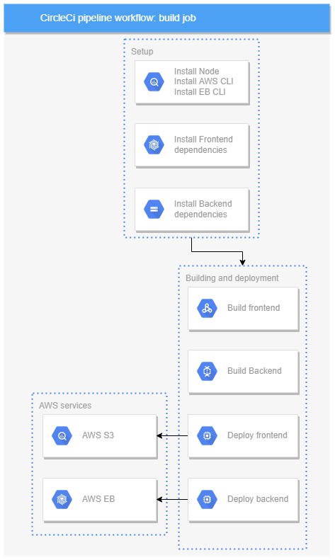

## Pipeline

This document explains the pipeline process used to automate building and deployment

This project uses `circleci` to automate the build and deployment process.

all steps are under a single `build` job.

### Steps
1. `Setup`: This step involves setting up the environment required to build and deploy the project and install the dependencies. includes installing `circleci` Node, AWS CLI, and Elastic beanstalk orbs for use in future steps. Then moves on to execute the `npm install` script for both `udagram-api` and `udagranm-frontend`

2. `Building and deployment`: This step involves building the project and deploying it to the server. First, both the frontend and backend are built using the `npm run build` command for both `udagram-api` and `udagranm-frontend` respectively. Then the frontend build uploaded to `S3` and the backend build is deployed to Elastic Beanstalk.

